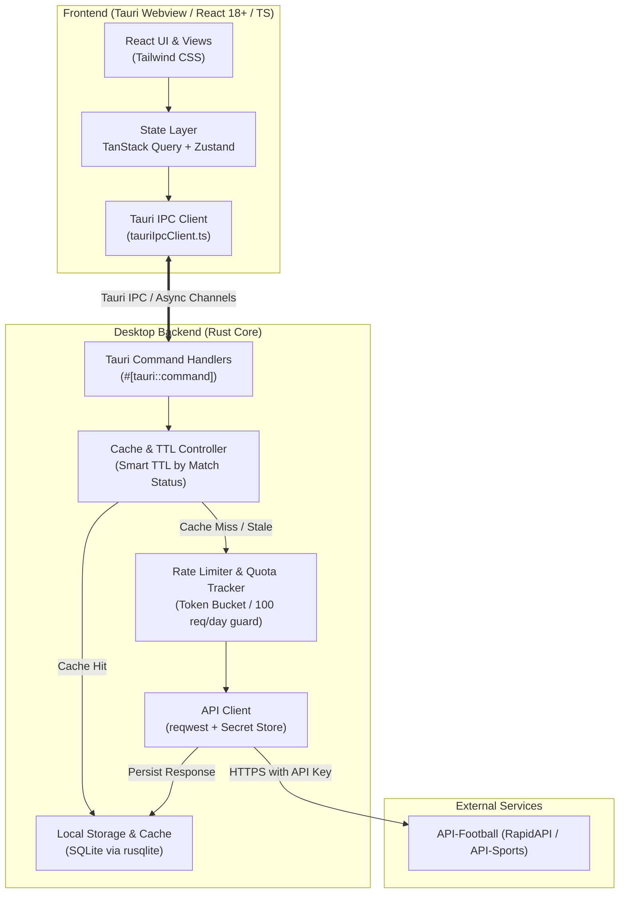
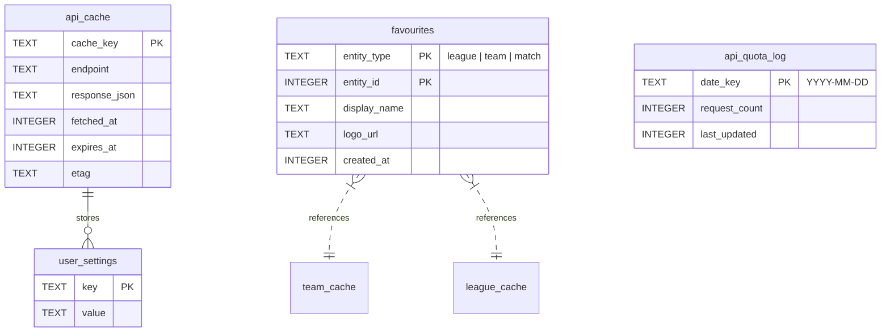
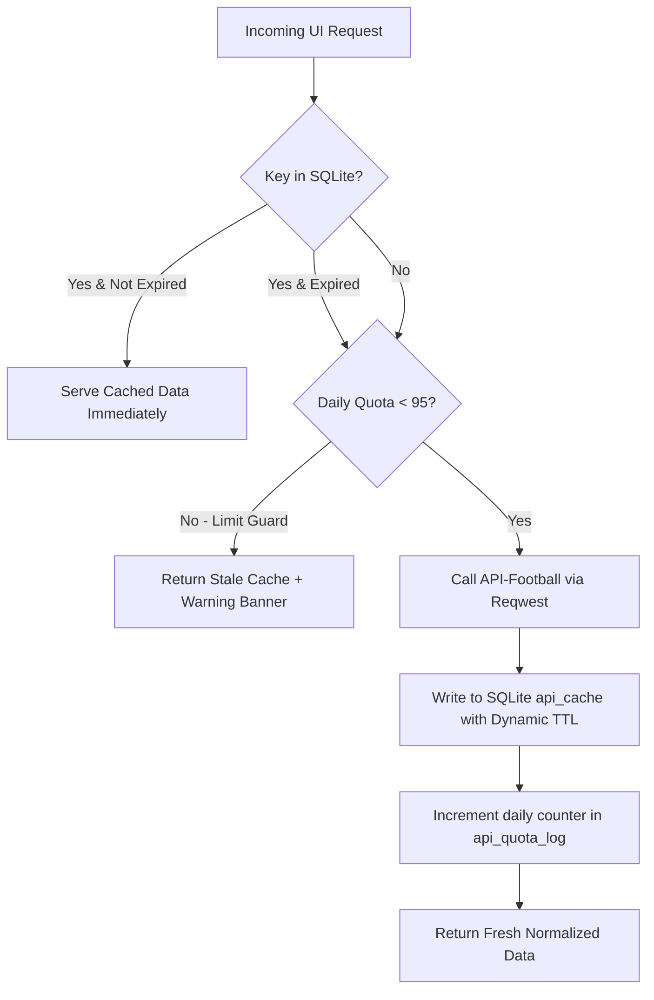
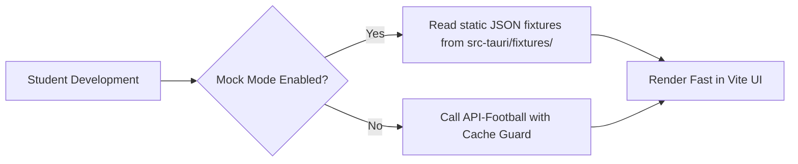
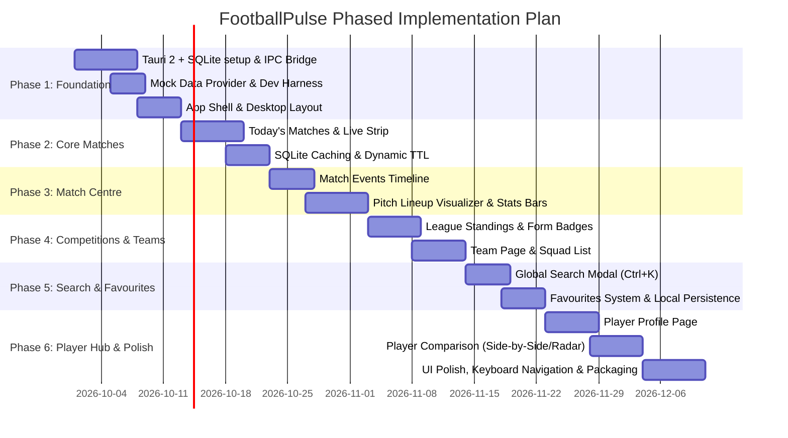

# FootballPulse — Technical Architecture & Implementation Plan

FootballPulse is an original, performant desktop football live-score, match-centre, and analytics application built with **Tauri 2**, **React**, **TypeScript**, **Tailwind CSS**, **Rust**, and **SQLite**, consuming **API-Football**.

---

## 1. System Architecture Overview



### Architecture Principles for a Single Student Developer
1. **Zero Leaked Secrets**: The frontend never holds or transmits the API-Football key. All remote HTTP queries originate strictly in Rust.
2. **Offline-First & Quota-First**: The API-Football free tier provides only **100 requests per day**. Every request must be guarded by SQLite persistence with intelligent TTLs.
3. **Decoupled API Contract**: Frontend never uses raw API-Football types directly. Clean internal TypeScript types shield the UI from upstream API schema changes.
4. **Mock Mode for Rapid UI Development**: An IPC switch allows running mock JSON data during UI development so you don't exhaust your 100 requests in 10 minutes while styling components.

---

## 2. Rust & Tauri Responsibilities

| Subsystem | Specific Responsibility |
| :--- | :--- |
| **Secret Storage** | Securely loads `API_KEY` from system environment or encrypted local settings file (`app_data_dir`). Key is never exposed to the Webview. |
| **SQLite DB & Migrations** | Manages local SQLite connection pool (`rusqlite`), runs migrations on startup, and exposes CRUD commands. |
| **HTTP & Rate Limiter** | Wraps `reqwest` client with exponential backoff, request deduplication, and a persistent daily counter to halt calls at 95/100 requests. |
| **Cache Orchestration** | Computes TTL based on fixture status (Live vs Finished vs Scheduled) and serves cached JSON whenever valid. |
| **Background Live Poller** | Runs an asynchronous timer that polls live fixtures every 45–60s **only** when the user is actively viewing a live match screen. Pauses when window is minimized. |

### Core Tauri Commands (`src-tauri/src/commands/`)
```rust
// Matches & Match Centre
get_matches_by_date(date: String, live_only: bool) -> Result<Vec<MatchSummary>, String>
get_match_detail(fixture_id: u32) -> Result<MatchDetail, String>

// Standings & Competitions
get_league_standings(league_id: u32, season: u32) -> Result<StandingsResponse, String>
get_league_fixtures(league_id: u32, season: u32, next: u32) -> Result<Vec<MatchSummary>, String>

// Teams & Players
get_team_profile(team_id: u32) -> Result<TeamProfile, String>
get_player_profile(player_id: u32) -> Result<PlayerProfile, String>
compare_players(player_id_a: u32, player_id_b: u32) -> Result<PlayerComparison, String>

// Search & Favourites
search_entities(query: String) -> Result<SearchResults, String>
toggle_favourite(item: FavouriteItem) -> Result<bool, String>
get_favourites() -> Result<Vec<FavouriteItem>, String>

// App Status & Quota
get_quota_status() -> Result<QuotaInfo, String>
```

---

## 3. SQLite Database Design



### Table Definitions

```sql
-- 1. General Key-Value Cache for API Responses
CREATE TABLE IF NOT EXISTS api_cache (
    cache_key TEXT PRIMARY KEY,       -- e.g. "fixtures_date_2026-10-01", "fixture_1029384"
    endpoint TEXT NOT NULL,           -- e.g. "/fixtures"
    response_json TEXT NOT NULL,      -- Full normalized JSON payload
    fetched_at INTEGER NOT NULL,      -- Unix timestamp (seconds)
    expires_at INTEGER NOT NULL,      -- Unix timestamp (seconds)
    etag TEXT                         -- Optional HTTP ETag
);

CREATE INDEX IF NOT EXISTS idx_api_cache_expires ON api_cache(expires_at);

-- 2. User Favourites
CREATE TABLE IF NOT EXISTS favourites (
    entity_type TEXT NOT NULL,        -- 'league', 'team', or 'player'
    entity_id INTEGER NOT NULL,       -- ID from API-Football
    display_name TEXT NOT NULL,
    logo_url TEXT,
    created_at INTEGER NOT NULL,
    PRIMARY KEY (entity_type, entity_id)
);

-- 3. User Settings & UI Preferences
CREATE TABLE IF NOT EXISTS user_settings (
    key TEXT PRIMARY KEY,             -- 'theme', 'selected_leagues', 'odds_format', 'mock_mode'
    value TEXT NOT NULL
);

-- 4. API Request Budget Monitor
CREATE TABLE IF NOT EXISTS api_quota_log (
    date_key TEXT PRIMARY KEY,        -- '2026-10-01'
    request_count INTEGER DEFAULT 0,
    last_updated INTEGER NOT NULL
);
```

---

## 4. API Architecture & Request Optimization

### The 100 Requests/Day Budget Strategy
On API-Football's free tier, you have 100 requests per 24 hours. The app must never burn through these while testing or running.



### Dynamic TTL Invalidation Matrix

| Fixture Status | Status Code | TTL Duration | Reasoning |
| :--- | :--- | :--- | :--- |
| **Finished** | `FT`, `AET`, `PEN` | **30 days** | Match result, stats, and lineups are immutable. Never re-fetch. |
| **In-Play / Live** | `1H`, `2H`, `HT`, `ET` | **60 seconds** | Changes frequently; update only during active user focus. |
| **Upcoming (>24h)** | `NS` | **12 hours** | Match times rarely shift. |
| **Upcoming (<2h)** | `NS` | **15 minutes** | Official lineups are released 45–60 min before kickoff. |
| **League Standings** | N/A | **6 hours** | Updates only after match days end. |
| **Team / Player Bio** | N/A | **7 days** | Core player/team profile details change very infrequently. |

### Live Polling Guard Rails
1. **Window Focus Detection**: Use Tauri's `on_window_event` (`WindowEvent::Focused(false)`). When the app is minimized or loses focus, live polling is paused.
2. **Active Route Verification**: Live polling only ticks if the active route is `/` (live filter active) or `/matches/:id` (for an in-play match). If viewing a team page, polling stops.
3. **Single Bulk Endpoint**: Use `/fixtures?live=all` or `/fixtures?ids=id1-id2` rather than polling individual matches.

---

## 5. TypeScript Domain Models (`src/types/`)

These clean frontend types abstract away the nested raw structures from API-Football.

```typescript
// src/types/match.ts
export type MatchStatus = 'SCHEDULED' | 'LIVE' | 'HALFTIME' | 'FINISHED' | 'POSTPONED' | 'CANCELLED';

export interface TeamSnippet {
  id: number;
  name: string;
  shortCode?: string;
  logo: string;
}

export interface MatchScore {
  home: number | null;
  away: number | null;
  halftime?: { home: number | null; away: number | null };
  penalty?: { home: number | null; away: number | null };
}

export interface MatchSummary {
  id: number;
  slug: string;
  status: MatchStatus;
  statusShort: string;       // '1H', 'HT', 'FT', etc.
  minute?: number;           // 64'
  kickoffTime: string;       // ISO 8601
  league: {
    id: number;
    name: string;
    country: string;
    logo: string;
    flag?: string;
    round?: string;
  };
  homeTeam: TeamSnippet;
  awayTeam: TeamSnippet;
  score: MatchScore;
}

export interface MatchEvent {
  id: string;
  minute: number;
  extraMinute?: number;
  teamId: number;
  type: 'GOAL' | 'CARD' | 'SUBSTITUTION' | 'VAR';
  detail: string;            // 'Normal Goal', 'Yellow Card', etc.
  player: { id: number; name: string };
  assist?: { id: number; name: string };
  comments?: string;
}

export interface PlayerInLineup {
  id: number;
  name: string;
  number: number;
  pos: 'G' | 'D' | 'M' | 'F';
  grid?: string;             // '4:2' for tactical pitch rendering
}

export interface TeamLineup {
  team: TeamSnippet;
  formation: string;         // '4-3-3', '4-2-3-1'
  coach: { id: number; name: string; photo?: string };
  startingXI: PlayerInLineup[];
  substitutes: PlayerInLineup[];
}

export interface StatItem {
  type: string;              // 'Ball Possession', 'Total Shots', 'Corner Kicks', 'Fouls'
  home: number | string;
  away: number | string;
  homePercentage?: number;   // Calculated for progress bars
}

export interface MatchDetail extends MatchSummary {
  referee?: string;
  venue?: { name: string; city: string };
  events: MatchEvent[];
  lineups: {
    home: TeamLineup | null;
    away: TeamLineup | null;
  };
  statistics: StatItem[];
}
```

```typescript
// src/types/league.ts & player.ts
export interface StandingRow {
  rank: number;
  team: TeamSnippet;
  points: number;
  played: number;
  won: number;
  drawn: number;
  lost: number;
  goalsFor: number;
  goalsAgainst: number;
  goalDifference: number;
  form: string;              // 'W,D,W,L,W'
  description?: string;      // 'Promotion - Champions League (Group Stage)'
}

export interface PlayerProfile {
  id: number;
  name: string;
  firstname: string;
  lastname: string;
  age: number;
  birthDate: string;
  nationality: string;
  photo: string;
  height?: string;
  weight?: string;
  currentTeam: TeamSnippet;
  position: 'Goalkeeper' | 'Defender' | 'Midfielder' | 'Attacker';
  stats: {
    appearances: number;
    minutes: number;
    goals: number;
    assists: number;
    yellowCards: number;
    redCards: number;
    rating?: number;
    shotsPerGame?: number;
    passAccuracy?: number;
  };
}

export interface PlayerComparison {
  playerA: PlayerProfile;
  playerB: PlayerProfile;
  radarMetrics: {
    label: string;
    valueA: number;
    valueB: number;
    maxScale: number;
  }[];
}
```

---

## 6. React Folder Structure

A modular, feature-first structure that scales smoothly without excessive abstractions:

```
src/
├── assets/                  # App icons, SVG pitch textures, placeholders
├── components/
│   ├── common/              # Pure reusable atomic components
│   │   ├── Badge.tsx
│   │   ├── Button.tsx
│   │   ├── Card.tsx
│   │   ├── EmptyState.tsx
│   │   ├── ErrorState.tsx
│   │   ├── Modal.tsx
│   │   ├── SearchInput.tsx
│   │   ├── Skeleton.tsx
│   │   ├── Tabs.tsx
│   │   └── Tooltip.tsx
│   ├── layout/              # Desktop frame layouts
│   │   ├── AppLayout.tsx
│   │   ├── Header.tsx
│   │   ├── NavigationSidebar.tsx
│   │   ├── QuotaBadge.tsx
│   │   └── TitleBar.tsx     # Custom Tauri window controls
│   └── feedback/
│       └── OfflineBanner.tsx
├── features/                # Feature-sliced modules
│   ├── matches/
│   │   ├── components/
│   │   │   ├── MatchCard.tsx
│   │   │   ├── MatchListGrouped.tsx
│   │   │   ├── MatchTimeline.tsx
│   │   │   ├── LineupPitch.tsx
│   │   │   ├── StatComparisonBar.tsx
│   │   │   └── LiveBadge.tsx
│   │   ├── hooks/
│   │   │   ├── useMatches.ts
│   │   │   ├── useMatchDetail.ts
│   │   │   └── useLivePoller.ts
│   │   └── MatchCentrePage.tsx
│   ├── leagues/
│   │   ├── components/
│   │   │   ├── StandingsTable.tsx
│   │   │   ├── LeagueHeader.tsx
│   │   │   └── FormIndicator.tsx
│   │   ├── hooks/useLeagueStandings.ts
│   │   └── LeagueDetailPage.tsx
│   ├── teams/
│   │   ├── components/
│   │   │   ├── TeamHeader.tsx
│   │   │   ├── SquadList.tsx
│   │   │   └── RecentMatchesList.tsx
│   │   ├── hooks/useTeamProfile.ts
│   │   └── TeamDetailPage.tsx
│   ├── players/
│   │   ├── components/
│   │   │   ├── PlayerBioCard.tsx
│   │   │   ├── PlayerRadarChart.tsx
│   │   │   └── StatGrid.tsx
│   │   ├── hooks/usePlayerProfile.ts
│   │   ├── hooks/usePlayerComparison.ts
│   │   ├── PlayerDetailPage.tsx
│   │   └── PlayerComparePage.tsx
│   ├── search/
│   │   ├── components/SearchResultItem.tsx
│   │   ├── hooks/useGlobalSearch.ts
│   │   └── SearchModal.tsx
│   └── favourites/
│       ├── hooks/useFavourites.ts
│       └── FavouritesPage.tsx
├── routes/
│   └── AppRouter.tsx        # React Router hash-based routing
├── services/
│   ├── tauriIpc.ts          # Typed wrapper around @tauri-apps/api/core invoke
│   └── mockData.ts          # Offline fallback fixture dataset for UI styling
├── stores/
│   ├── useUiStore.ts        # Sidebar open/close, active dates, search modal
│   └── useSettingsStore.ts  # Theme, offline/mock mode toggle, favorite leagues
├── types/
│   ├── index.ts
│   ├── match.ts
│   ├── league.ts
│   └── player.ts
├── utils/
│   ├── dateUtils.ts         # Kickoff formatting, localized times
│   ├── statCalculators.ts   # Percentage bars, radar normalization
│   └── cn.ts                # clsx + tailwind-merge helper
├── App.tsx
├── main.tsx
└── index.css
```

---

## 7. State Management & Data Fetching

### Two-Tier State Separation
1. **Server & Cache State**: Managed strictly by **TanStack Query (React Query v5)**.
   - TanStack Query communicates with Rust via `invoke()` wrapped in query functions.
   - Handles deduplication, garbage collection, and window re-validation logic.
2. **Client UI State**: Managed by **Zustand**.
   - Handles global modal states (search shortcut `Ctrl+K`), selected date filter (`today`, `yesterday`, `tomorrow`), pinned sidebar items, and UI theme.

### Example Integration (`useMatchDetail.ts`)
```typescript
import { useQuery } from '@tanstack/react-query';
import { invoke } from '@tauri-apps/api/core';
import { MatchDetail } from '../../types/match';

export function useMatchDetail(fixtureId: number, isLive: boolean) {
  return useQuery<MatchDetail, Error>({
    queryKey: ['match', fixtureId],
    queryFn: async () => {
      return await invoke<MatchDetail>('get_match_detail', { fixtureId });
    },
    // If the match is live, auto-refetch every 45s; if finished, never refetch
    refetchInterval: isLive ? 45_000 : false,
    staleTime: isLive ? 30_000 : Infinity,
  });
}
```

---

## 8. Routing Strategy

In Tauri desktop environments, standard browser path routing (`BrowserRouter`) can encounter file protocol or reload issues. 
Use **HashRouter** from `react-router-dom`:

| Route Path | View | Description |
| :--- | :--- | :--- |
| `#/` | `HomePage` | Today's fixtures, live score strip, quick filter by Top 5 leagues. |
| `#/matches/:id` | `MatchCentrePage` | Deep-dive with tabs: *Overview*, *Timeline*, *Lineups*, *Stats*. |
| `#/leagues/:id` | `LeagueDetailPage` | Standings table, upcoming rounds, top scorers. |
| `#/teams/:id` | `TeamDetailPage` | Squad, upcoming schedule, league position. |
| `#/players/:id` | `PlayerDetailPage` | Season stats, radar metrics, bio. |
| `#/compare` | `PlayerComparePage` | Side-by-side metric table and radar comparison. |
| `#/favourites` | `FavouritesPage` | Curated dashboard of saved clubs and tournaments. |

Global Search is implemented as a **Floating Modal (`<SearchModal />`)** triggered by `Ctrl+K` / `Cmd+K` anywhere in the app rather than a full page reload.

---

## 9. UI/UX: Error, Loading & Empty States

A high-polish desktop app requires seamless feedback states:

1. **Skeleton Loaders (`<Skeleton />`)**:
   - Match card skeletons with pulsing home/away crests and score blocks.
   - Pitch lineup skeleton showing 11 placeholder player circles on a tactical pitch.
   - Standings table skeleton matching row heights to prevent layout shifts.
2. **Empty States (`<EmptyState />`)**:
   - *No live matches*: "There are no matches in play right now. Check upcoming fixtures below." + Shortcut button to jump to today's schedule.
   - *No favourites added*: "Pin your favourite clubs and leagues to get quick access to their fixtures." + Button to open Search.
   - *No search matches found*: "No results for '{query}'. Try searching by team name or competition."
3. **Quota & Offline Feedback**:
   - If the 100/day limit is approached or exceeded, a persistent subtle banner appears: `"Rate limit reached. Serving cached snapshot from {time} ago."` The user is never presented with an unhandled crash or white screen.

---

## 10. Security & Credential Management

1. **No Frontend API Exposure**:
   - `API_KEY` is **never** prefixed with `VITE_` and never imported into TypeScript.
   - The key is read in Rust via:
     ```rust
     let api_key = std::env::var("FOOTBALLPULSE_API_KEY")
         .unwrap_or_else(|_| load_from_secure_config());
     ```
2. **IPC Parameter Sanitization**:
   - Tauri commands take strongly typed primitives (`u32`, `String`), preventing injection attacks.
   - SQL queries in `rusqlite` use strictly parameterized binds (`?1, ?2`).
3. **Strict Content Security Policy (CSP)** in `tauri.conf.json`:
   - Restricts `img-src` to `https://media.api-sports.io` (for club logos and player photos) and `data:`. Disallows arbitrary external script injection.

---

## 11. Testing & Mock Strategy

To conserve daily API calls and ensure testability:



1. **Static Mock Dataset**:
   - Store 3–4 full fixture responses in `src-tauri/fixtures/` (`sample_live.json`, `sample_finished.json`, `sample_standings.json`).
   - A toggle in the Settings / Dev bar enables `Mock Mode`. You can build, debug, and style all 14 MVP screens with **zero** API quota usage.
2. **Vitest (Frontend)**:
   - Test data formatting functions (e.g., date conversion, form string parser `'W,D,L'`, goal difference calculators).
   - Test `<StatComparisonBar />` percentage math.
3. **Cargo Test (Rust Backend)**:
   - Test SQLite cache insert, expiration query, and JSON deserialization logic.

---

## 12. Phased Roadmap & Implementation Order

### What to Implement FIRST vs What to DEFER



### Detailed Prioritization Matrix

| Priority Stage | Feature / Task | Complexity | Why It Belongs Here |
| :--- | :--- | :--- | :--- |
| **P0: Immediate (Phase 1)** | Tauri 2 + Rust SQLite boilerplate, Mock Data Mode | Low | Foundation. Allows building UI without burning API calls. |
| **P0: Immediate (Phase 1)** | Responsive desktop AppLayout (Sidebar, Header, Main) | Low | Structural container for all routes. |
| **P0: Immediate (Phase 2)** | Today's Matches & Live Score list | Medium | Core value proposition of any live football app. |
| **P0: Immediate (Phase 2)** | SQLite Cache Manager + Dynamic TTL | Medium | Absolute prerequisite before turning on live API-Football key. |
| **P1: Essential (Phase 3)** | Match Centre (Events timeline, Lineup pitch, Stats) | High | The "hero" screen where users spend the most time. |
| **P1: Essential (Phase 4)** | League Standings & Form Guide | Medium | High user engagement, simple tabular layout. |
| **P1: Essential (Phase 4)** | Team Page (Squad & Results) | Medium | Natural navigation target from match centre and standings. |
| **P2: Complete MVP (Phase 5)**| Global Search (Ctrl+K modal) & Favourites | Medium | Connects navigation together, allows personalized home view. |
| **P2: Complete MVP (Phase 6)**| Player Profile Page | Medium | Core stats and bio. |
| **P2: Complete MVP (Phase 6)**| Player Comparison | Medium | Standout MVP feature differentiating from basic score tickers. |
| **P3: DEFERRED (Post-MVP)** | xG, Momentum Charts, Shot Maps | High | API-Football basic tier lacks reliable xG; requires custom calculations. |
| **P3: DEFERRED (Post-MVP)** | News & Transfers | Medium | Supplementary; bloats MVP scope. |
| **P3: DEFERRED (Post-MVP)** | AI Scout Reports | High | Requires LLM integration and API token costs; defer until core app is solid. |
